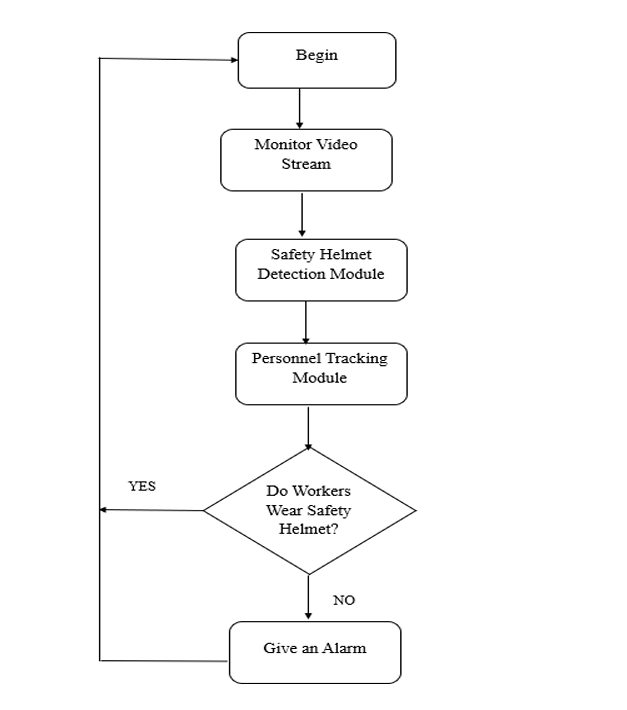

# BOROSA Hackathon 2024 - Two-Wheeler Safety System

## Overview
This repository contains the solution document for the **BOROSA Hackathon 2024**, which focuses on enhancing road safety for two-wheeler commuters in Pune. The project aims to develop a comprehensive safety system that includes helmet detection, obstacle identification using radar technology, and an Anti-Lock Braking System (ABS).

## Diagrams
Here are some key diagrams from the project:

### Helmet Detection Flowchart
 <!-- Replace with the actual image filename -->

### Object Detection Flowchart
 <!-- Replace with the actual image filename -->

### ABS Working Flowchart
 <!-- Replace with the actual image filename -->

## Problem Statement
Pune, a bustling city with a high volume of two-wheeler traffic, faces significant road safety challenges. The increasing number of accidents, often due to the lack of helmet usage and inadequate awareness of surroundings, necessitates innovative technological solutions.

## Project Objectives
- **Helmet Detection**: Implement a machine learning algorithm to detect whether riders are wearing helmets.
- **Obstacle Detection**: Utilize radar technology to identify obstacles in the rider's path.
- **Anti-Lock Braking System (ABS)**: Integrate ABS to prevent wheel lock-up during sudden braking, enhancing rider control and safety.

## Solution Components
1. **Helmet Detection**:
   - Utilizes Convolutional Neural Networks (CNNs) for real-time helmet detection.
   - Employs image processing techniques to classify riders as "with helmet" or "without helmet."

2. **Radar-Based Object Detection**:
   - Implements radar technology to detect objects within a specified range.
   - Uses ultrasonic sensors and Arduino for processing and alerting riders of nearby obstacles.

3. **Anti-Lock Braking System (ABS)**:
   - Integrates ABS to prevent wheel lock-up and reduce wear and tear on brakes.
   - Enhances rider safety by maintaining control during emergency stops.

## Installation
To run the project locally, follow these steps:

1. Clone the repository:
   ```bash
   git clone https://github.com/yourusername/your-repo-name.git
